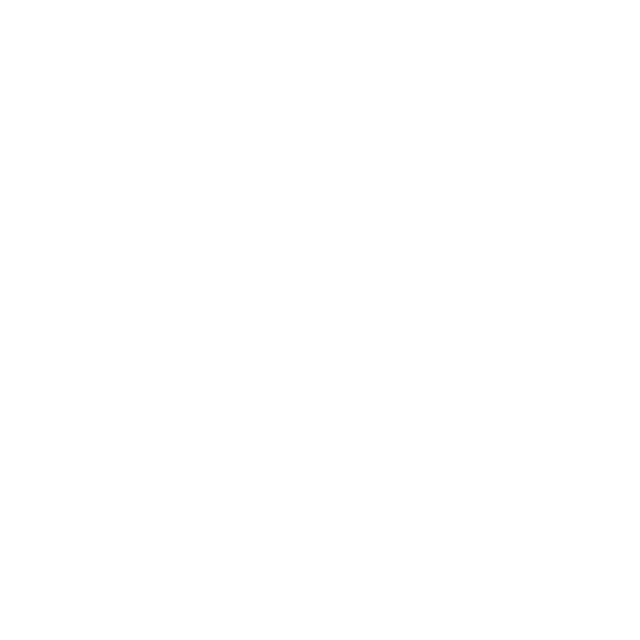

#  Configuration Guide

<p>
  
  
  
</p>

HostPilot uses **environment variables** stored inside a `.env` file to manage configuration securely and efficiently.

All required credentials and settings must be defined before starting the bot.

---

#  Required Variables

Create a `.env` file in the project root directory and add the following variables:

```
DISCORD_TOKEN=your_discord_bot_token

ALLOWED_ROLE_ID=your_allowed_role_id

MONEY_LOG_CHANNEL_ID=your_money_log_channel_id
REPORT_CHANNEL_ID=your_report_channel_id

PTERO_PANEL_URL=https://your_panel_url
PTERO_API_KEY=your_pterodactyl_api_key
PTERO_ALLOCATION_ID=your_allocation_id

TIMEZONE=Asia/Kolkata
```

---

#  Variable Descriptions

### DISCORD_TOKEN

The authentication token used to run the Discord bot.

Source:
Discord Developer Portal → Bot → Token

---

### ALLOWED_ROLE_ID

Role ID required to access restricted commands.

Used for permission-based command control.

---

### MONEY_LOG_CHANNEL_ID

Channel ID where financial transactions are logged.

---

### REPORT_CHANNEL_ID

Channel ID where generated reports are sent.

---

### PTERO_PANEL_URL

Base URL of your Pterodactyl panel.

Example:

```
https://panel.example.com
```

---

### PTERO_API_KEY

API key used to authenticate requests to the Pterodactyl API.

Keep this value **secure** and never share it publicly.

---

### PTERO_ALLOCATION_ID

Allocation ID used when creating servers.

This ID must exist in the Pterodactyl panel.

---

### TIMEZONE

Defines the timezone used for scheduling reminders and automation tasks.

Example values:

```
Asia/Kolkata
UTC
Europe/London
America/New_York
```

---

#  Example Configuration

Below is a complete example `.env` file:

```
DISCORD_TOKEN=your_token_here

ALLOWED_ROLE_ID=123456789012345678

MONEY_LOG_CHANNEL_ID=123456789012345678
REPORT_CHANNEL_ID=123456789012345678

PTERO_PANEL_URL=https://panel.example.com
PTERO_API_KEY=your_api_key_here
PTERO_ALLOCATION_ID=15

TIMEZONE=Asia/Kolkata
```

---

#  Configuration Notes

<p>
  
  
</p>

Before starting the bot:

* Ensure all required variables are defined
* Verify API keys are correct
* Confirm role and channel IDs exist
* Validate timezone format
* Never commit `.env` files to GitHub

---

#  Recommended File Placement

Place the `.env` file in the root directory:

```
hostpilot/
│
├── .env
├── bot.py
├── config.py
├── cogs/
└── docs/
```

---
